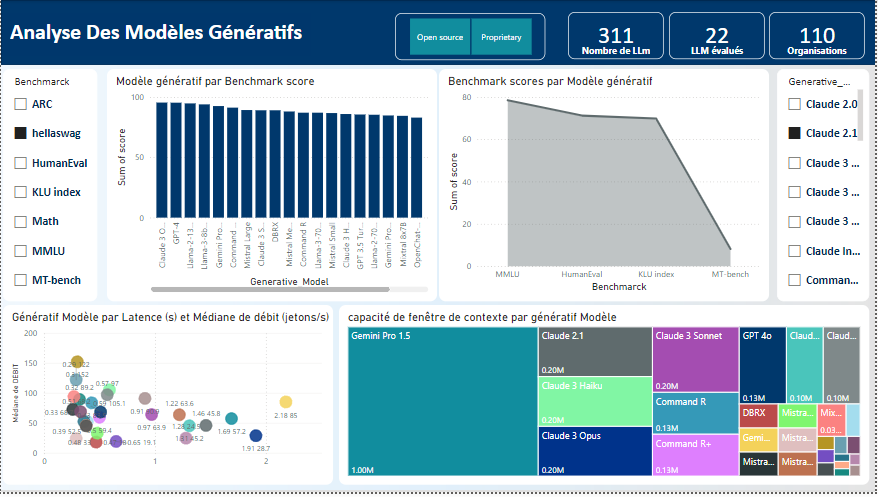
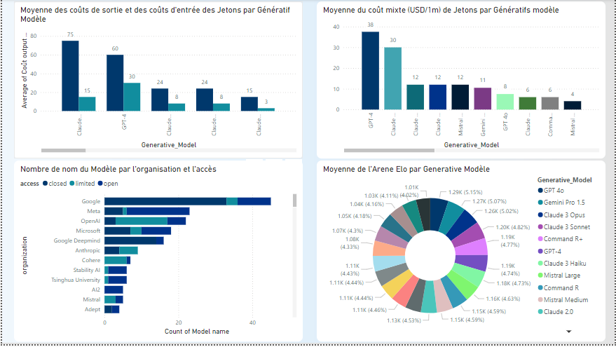
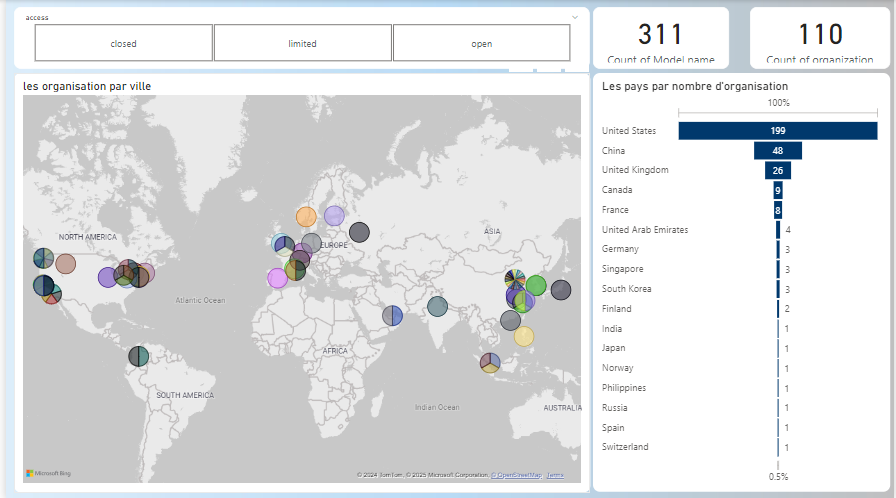

# Power BI Dashboard : LLM Performance Across Benchmarks
  This dashboard provides a detailed analysis of the performance of Large Language Models (LLMs) across various benchmarks. It presents key metrics such as accuracy, latency, throughput, and contextual understanding to compare and evaluate the efficiency and capabilities of different models.

## Key Features
### Benchmark Analysis : 
  In-depth evaluation of performance across benchmarks like MMLU, HumanEval, Math, and MT-Bench.
### Model Comparison : 
  Visual comparison of LLMs from various organizations to highlight top performers.
### Interactive Visuals : 
  Drill-down functionality to explore individual metrics and benchmarks in detail.
Cost and Latency Insights : 
Analysis of blended costs per million tokens and latency for informed decision-making.
### Use Case :
This dashboard is designed for :

    1-  Researchers analyzing LLM performance for academic or industrial purposes
    2-  Developers choosing the most suitable model for their applications
    3-  AI Enthusiasts exploring trends and comparative strengths of LLMs
### Dashboard First Page :

### Dashboard Second Page :

### Dashboard Third Page :

